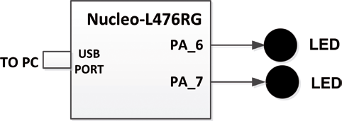

# AlternateLEDs

En este proyecto se conectan dos LED a los puertos GPIO PA6 y PA7 de la placa Nucleo-L476RG. Los LED parpadean alternativamente cada 500 ms. El objetivo de este proyecto es mostrar cómo se pueden conectar componentes externos (por ejemplo, LED) a la placa Nucleo-L476RG

Diagrama de bloques del proyecto:
 

## Video test

https://github.com/PuertOcho/AlternateLEDs/assets/57835621/9d71bfdf-87d3-4dff-b7b0-4766524de3c6
